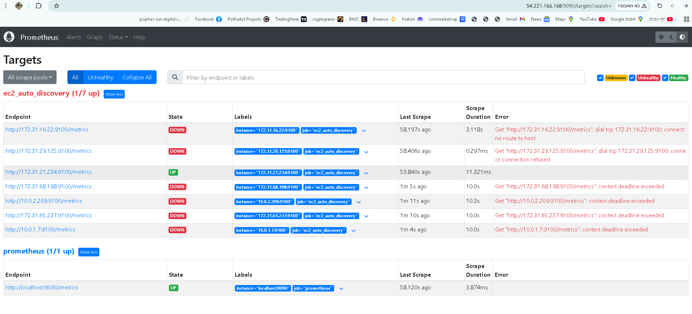
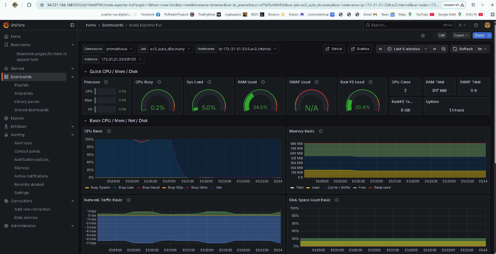
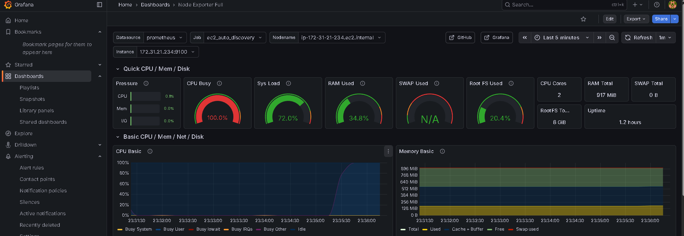
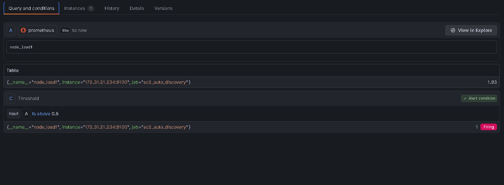
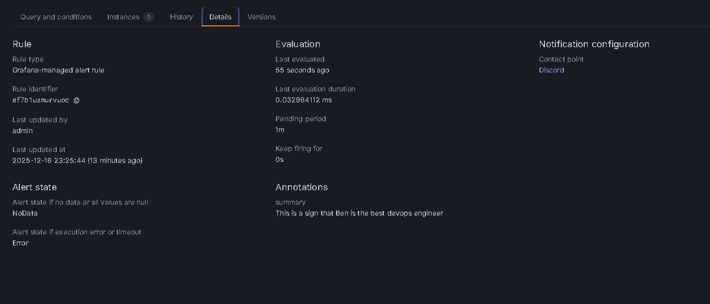
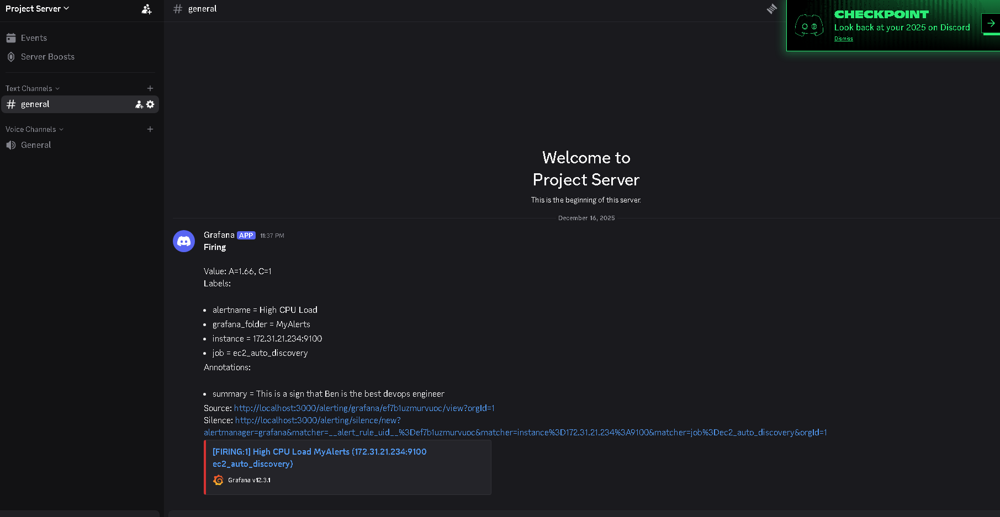

# ☁️ AWS Dynamic Observability Pipeline
### End-to-End Monitoring Stack with Prometheus, Grafana & Discord

   

## 📖 Project Overview
This project implements a fully automated monitoring pipeline for a dynamic fleet of AWS EC2 instances.
Instead of static configuration, the system utilizes **AWS Service Discovery** to automatically detect new instances, scrape their metrics via **Node Exporter**, visualize the data in **Grafana**, and trigger real-time alerts to **Discord** when critical thresholds (e.g., CPU Load) are breached.

---

## 🏗 Architecture
The pipeline consists of the following components:

1.  **AWS EC2 Fleet**: Linux servers running `node_exporter` to expose system metrics.
2.  **IAM Roles**: Securely granting Prometheus permissions to query the AWS API (`ec2:DescribeInstances`).
3.  **Prometheus**: Configured with `ec2_sd_configs` for dynamic target discovery.
4.  **Grafana**: Providing a rich visualization layer (dashboards).
5.  **Alert Manager**: Routing critical alerts to a Discord webhook.

---

## 🚀 Key Features & Visual Walkthrough

### 1. Automated Service Discovery
Unlike traditional monitoring where IPs are hardcoded, my Prometheus server queries the AWS API to find targets.
As seen below, Prometheus successfully discovered the fleet, identifying the healthy node (UP) and flagging unreachable ones (demonstrating the health check capability).



### 2. Full System Visibility
Using Grafana, I imported a full Node Exporter dashboard to visualize CPU, RAM, and Network traffic in real-time.



### 3. Stress Testing & Anomaly Detection
To validate the alerting logic, I simulated a high-load event using the `stress` tool on the EC2 instance.
The graph below clearly shows the CPU spike generated during the test.



### 4. Alerting Logic (The "Brain")
I configured a custom alert rule based on the `node_load1` metric.
* **Threshold**: Trigger if Load > 0.5.
* **State**: The screenshot below captures the alert in the **Firing** state during the stress test (Value: 1.93).




### 5. Real-Time Notifications
Once the firing condition was met and the pending period passed, the system automatically sent a notification to the DevOps Discord channel.



---

## 🛠️ How to Reproduce

### Prerequisites
* AWS Account (Free Tier eligible).
* EC2 Instance (Amazon Linux 2 / Ubuntu).
* Docker installed.

### Step 1: Install Node Exporter (Client)
```bash
wget [https://github.com/prometheus/node_exporter/releases/download/v1.5.0/node_exporter-1.5.0.linux-amd64.tar.gz](https://github.com/prometheus/node_exporter/releases/download/v1.5.0/node_exporter-1.5.0.linux-amd64.tar.gz)
tar xvfz node_exporter-*.*-amd64.tar.gz
cd node_exporter-*.*-amd64
./node_exporter
```

### Step 2: Configure Prometheus (Server)
`prometheus.yml` configuration for AWS discovery:
```yaml
scrape_configs:
  - job_name: 'ec2_auto_discovery'
    ec2_sd_configs:
      - region: us-east-1
        port: 9100
    relabel_configs:
      - source_labels: [__meta_ec2_tag_Name]
        target_label: instance
```

### Step 3: Run the Stack
```bash
# Run Prometheus
docker run -d -p 9090:9090 -v $(pwd)/prometheus.yml:/etc/prometheus/prometheus.yml prom/prometheus

# Run Grafana
docker run -d -p 3000:3000 grafana/grafana
```
